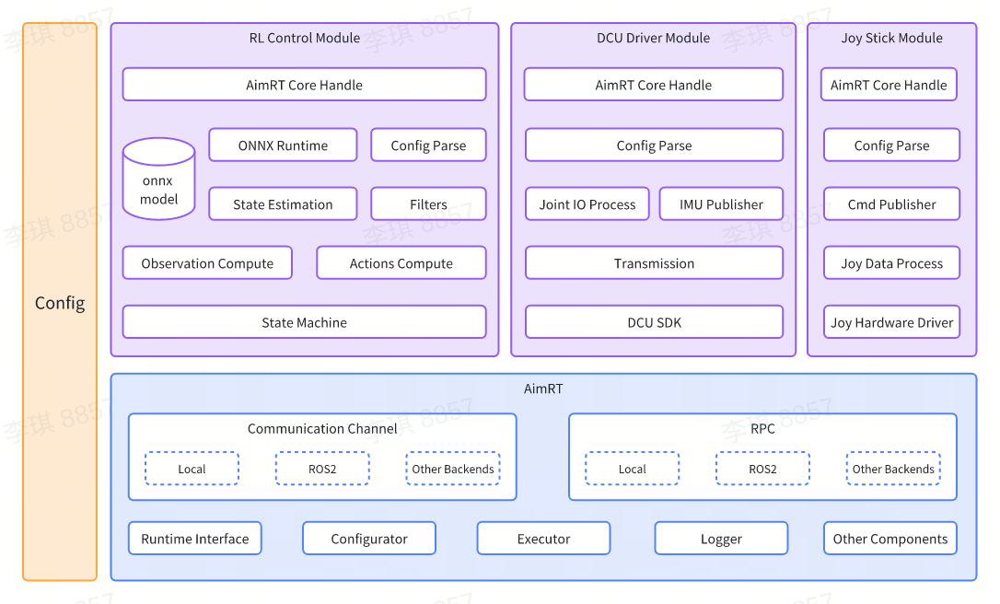

# Readme

[English](README.md) | [中文](README.zh_CN.md) | 日本語

## 紹介

[智元灵犀X1](https://www.zhiyuan-robot.com/qzproduct/169.html) は、智元が開発しオープンソース化したモジュラー型高自由度ヒューマノイドロボットです。X1のソフトウェアシステムは、智元のオープンソースコンポーネント `AimRT` をミドルウェアとして実装し、強化学習を用いて運動制御を行います。

このプロジェクトは、智元灵犀X1の付属ソフトウェアであり、モデル推論、プラットフォームドライバ、ソフトウェアシミュレーションなどの複数の機能モジュールを含みます。

`AimRT` コンポーネントの詳細なチュートリアルについては、[AimRT公式サイト](https://aimrt.org/) をご覧ください。


## ソフトウェアアーキテクチャ図



各モジュールの詳細な注釈については、[開発ガイド](doc/tutorials.ja_JP.md) を参照してください。

## ディレクトリ構造

```bash
.
├── build.sh              # ビルドスクリプト
├── cmake                 # ビルド依存関係のCMakeスクリプト
│   ├── GetAimRT.cmake
│   ├── GetGTest.cmake
│   └── NamespaceTool.cmake
├── CMakeLists.txt        # トップレベルのCMakeLists.txt
├── format.sh             # フォーマットスクリプト
├── README.md             # 説明文書
├── doc                   # 開発ガイドディレクトリ
├── src                   # ソースコードディレクトリ
│   ├── CMakeLists.txt    # ソースコードディレクトリのCMakeLists.txt
│   ├── assistant         # ROS2シミュレーションとサンプルプロジェクトディレクトリ
│   ├── install           # 設定スクリプトディレクトリ
│   ├── module            # モジュールディレクトリ
│   ├── pkg               # デプロイメントディレクトリ
│   └── protocols         # プロトコルディレクトリ
└── test.sh               # テストスクリプト
```

## 実行方法

### 起動準備

- [cmake](https://cmake.org/download/) 3.26以上のバージョンをインストールします。

- [ONNX Runtime](https://github.com/microsoft/onnxruntime) をインストールします。

```bash
sudo apt update
sudo apt install -y build-essential cmake git libprotobuf-dev protobuf-compiler

git clone --recursive https://github.com/microsoft/onnxruntime

cd onnxruntime
./build.sh --config Release --build_shared_lib --parallel

cd build/Linux/Release/
sudo make install
```

- `ROS2 Humble` をインストールし、環境変数を設定します。詳細は [ROS2公式サイト](https://docs.ros.org/en/humble/Installation/Ubuntu-Install-Debians.html) を参照してください。

- シミュレーション環境の依存関係をインストールします。

```bash
sudo apt install jstest-gtk \
                 ros-humble-xacro \
                 ros-humble-gazebo-ros-pkgs \
                 ros-humble-gazebo-ros2-control \
                 ros-humble-joint-state-publisher \
                 ros-humble-joint-state-broadcaster \
                 
```

- 実機デバッグを行う場合は、Linuxの[リアルタイムカーネルパッチ](https://wiki.linuxfoundation.org/realtime/start) をインストールします��

*AimRTの依存関係が多いため、デフォルトのソースから依存関係をダウンロードするのは非常に遅く、失敗することもあります。そのため、giteeソースに基づいて依存関係をダウンロードするための環境変数 `DOWNLOAD_FLAGS` を `url.bashrc` に提供しています。`build.sh` を実行する前に `url.bashrc` をソースし、giteeソースの環境変数パラメータを追加するだけです。*

上記の手順を完了したら、ターミナルで以下のコマンドを実行します：

```bash
source /opt/ros/humble/setup.bash
source url.bashrc

# ビルド
./build.sh $DOWNLOAD_FLAGS

# テスト
./test.sh $DOWNLOAD_FLAGS
```

### シミュレーションの起動

2つのターミナルを準備します：

```bash
cd build/

# ターミナル1：シミュレーションモードで推論モジュールとジョイスティック制御モジュールを起動します。
./run_sim.sh

# ターミナル2：Gazeboシミュレーションプログラムを起動します。
./run_gazebo.sh
```

### 実機の起動

まず、ライブラリパスをエクスポートします。**一度だけ実行すればOKです**。

```bash
# "/etc/ld.so.conf" をroot権限で開きます
sudo vi /etc/ld.so.conf

# このパスを "/etc/ld.so.conf" の末尾に追加します
/opt/ros/humble/lib
{YourProjectSource}/build/install/lib

# システム環境をリフレッシュします
sudo ldconfig
```

起動準備完了。

```bash
cd build/
./run.sh
```

### ジョイスティック制御

具体的な制御方法については、[ジョイスティック制御モジュール](doc/joy_stick_module/joy_stick_module.ja_JP.md) を参照してください。

## ライセンス契約

本プロジェクトで提供されるコードは、[AimRT](https://aimrt.org/) フレームワーク上で動作します。これは研究用コードであり、頻繁に変更されることが予想され、特定の目的への適用性については一切保証しません。ソースコードは [MULAN](https://spdx.org/licenses/MulanPSL-2.0.html) ライセンス契約の下で公開されています。

## 使用方法

このリポジトリに関して質問や問題がある場合は、`Issues` を使用してください。

メールでの連絡はご遠慮ください。返信できない場合があります。コードを提供したい場合は、リポジトリをフォークするか（またはコラボレーターであればブランチを作成し）、変更を加えてプルリクエストを送信してください。
